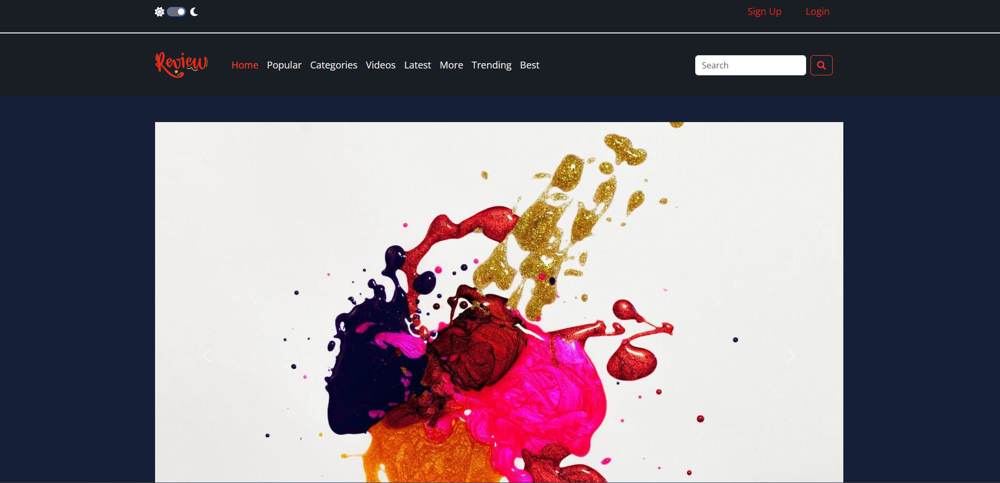
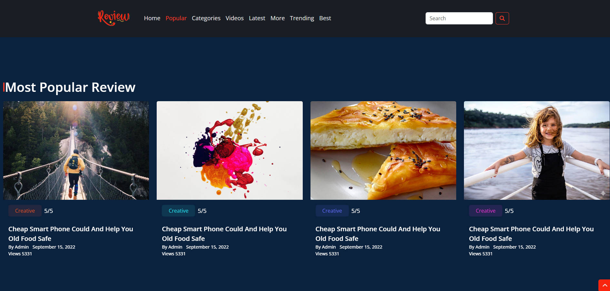
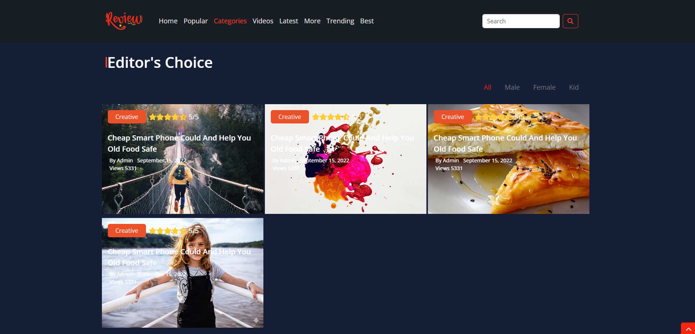
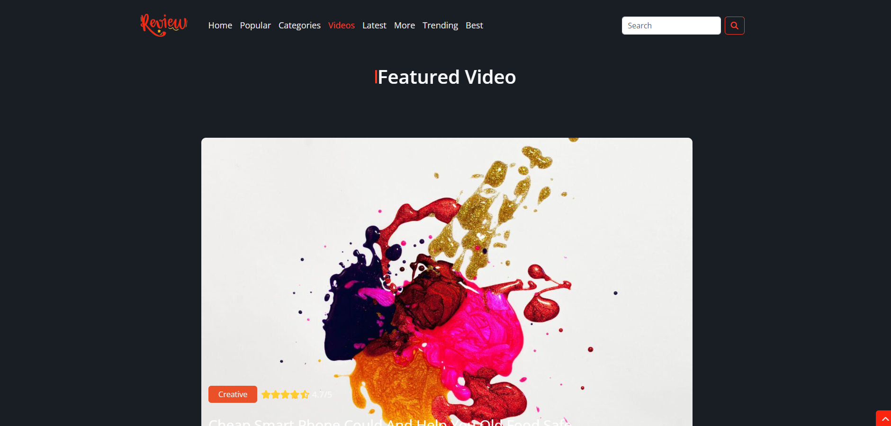
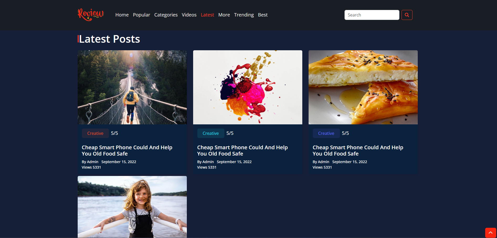
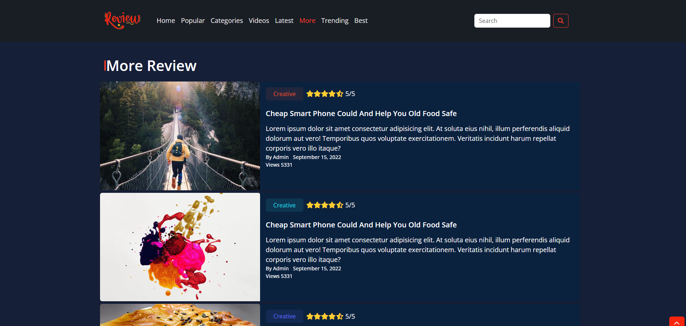
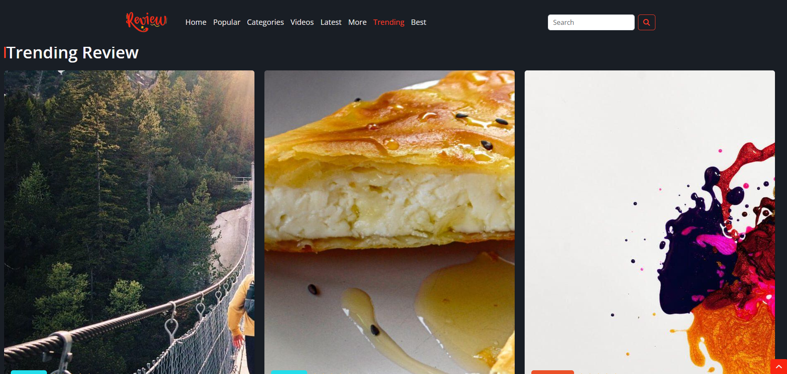
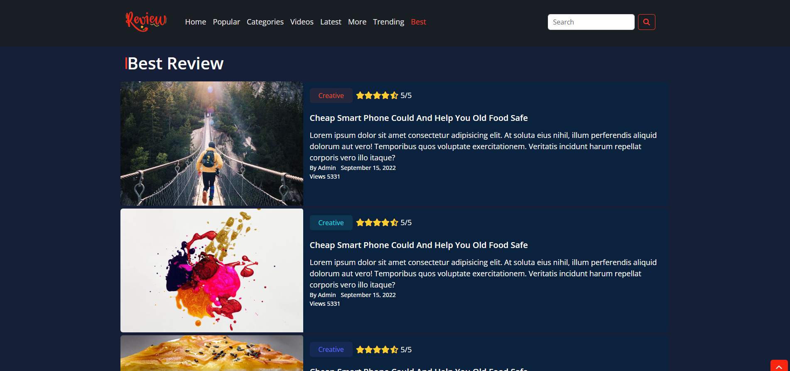
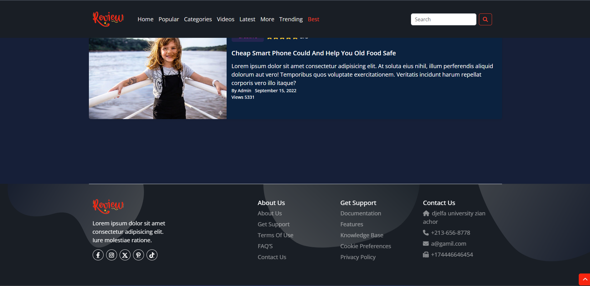

# TechReview — Blog & Review Website Template

> A feature-rich, multi-page **Tech Blog & Review** website template built with a full **Gulp 4** automation pipeline, **Pug** templating engine, and **SASS/SCSS**. Features a fully separated `stage/` source and `dist/` production output, a Node.js local server with **LiveReload**, a built-in **Dark/Light mode** with localStorage persistence, dynamic **Star Rating** system, and a rich library of reusable SASS mixins.

---

## 📸 Preview

| Home – Hero Carousel | Popular & Categories |
|---|---|
|  |  |

| Videos & Latest Posts | Trending & Best Review |
|---|---|
|  |  |

| Product Detail Page | Categories Page |
|---|---|
|  |  |

| Login Page | Sign Up Page |
|---|---|
|  |  |

| Add New Product |
|---|
|  |

---

## ✨ Features

- **Gulp 4 Build System** — Automated pipeline for HTML, CSS, JS, with watch + LiveReload
- **Pug Templating** — HTML split into reusable includes (layout, components, sections)
- **SASS/SCSS** — Compiled, autoprefixed, concatenated, and sourcemapped to `dist/css/main.css`
- **Dark / Light Mode** — Toggle switch in the upper navbar; preference persisted via `localStorage`
- **Dynamic Star Rating** — JS-powered star renderer supporting full, half, and empty stars
- **Category Filter** — Interactive filter menu on the Editor's Choice section
- **Smooth Scroll Navigation** — Navbar links scroll to sections via `data-scroll` attributes
- **Scroll-to-Top Button** — Floating button component (`up.pug`) for quick page navigation
- **Bootstrap Carousel** — Hero section with auto-sliding image slides and captions
- **Node.js Local Server** — `static-server` serves the `dist/` folder at `localhost:8080`
- **LiveReload** — Browser auto-refreshes on any file change
- **CSS Autoprefixer** — Automatically adds vendor prefixes for the last 2 browser versions
- **Source Maps** — CSS source maps generated for DevTools debugging
- **ZIP Export** — Gulp `compress` task bundles the entire `dist/` into `website.zip`
- **FTP Deploy Ready** — `vinyl-ftp` deploy task included (commented out, ready to configure)
- **Cairo Font** — Self-hosted variable weight Arabic font (OFL License)
- **Poppins Font** — Google Fonts for Latin content
- **Bootstrap 5** — Grid and utility classes
- **Font Awesome 6** — Self-hosted icon library

---

## 🗂️ Project Structure

```
template3/
│
├── stage/                              # 🔧 SOURCE — edit files here
│   ├── html/
│   │   ├── index.pug                   # Home page entry point
│   │   ├── categories.pug             # Categories / Editor's Choice page
│   │   ├── login.pug                  # Login page
│   │   ├── signup.pug                 # Sign Up page
│   │   ├── porduct.pug                # Product / Article detail page
│   │   ├── newproduct.pug             # New product submission page
│   │   └── pug/
│   │       ├── layout/
│   │       │   ├── meta.pug           # <head> meta tags
│   │       │   ├── navbar.pug         # Navbar with dark mode toggle + search
│   │       │   ├── styles.pug         # CSS <link> tags
│   │       │   ├── scripts.pug        # Common JS <script> tags
│   │       │   ├── scriptshome.pug    # Home-specific JS tags
│   │       │   └── scriptsproduct.pug # Product-specific JS tags
│   │       ├── components/
│   │       │   ├── info.pug           # Reusable info card component
│   │       │   └── up.pug             # Scroll-to-top button component
│   │       └── sections/
│   │           ├── home.pug           # Hero carousel section
│   │           ├── popular.pug        # Most Popular Review grid
│   │           ├── categories.pug     # Editor's Choice with filter menu
│   │           ├── videos.pug         # Featured Video gallery
│   │           ├── latest.pug         # Latest Posts grid
│   │           ├── more.pug           # More Review section
│   │           ├── trending.pug       # Trending Review horizontal carousel
│   │           ├── bast.pug           # Best Review featured card
│   │           └── footer.pug         # 5-column footer
│   │
│   ├── css/
│   │   ├── main.scss                  # SASS entry — imports all partials
│   │   └── sass/
│   │       ├── helpers/
│   │       │   ├── _variables.scss    # Color palette, breakpoints, transitions
│   │       │   └── _mixins.scss       # 20+ reusable SASS mixins
│   │       ├── components/
│   │       │   ├── _button.scss       # Custom button styles
│   │       │   ├── _carousel.scss     # Carousel component styles
│   │       │   ├── _img.scss          # Image utilities
│   │       │   └── _section.scss      # Shared section heading styles
│   │       └── layout/
│   │           ├── _global.scss       # Global reset & CSS variables (dark mode)
│   │           ├── _navbar.scss       # Navbar + upper-nav styles
│   │           ├── _footer.scss       # Footer styles
│   │           └── sections/
│   │               ├── _categories.scss
│   │               ├── _login.scss
│   │               ├── _newproduct.scss
│   │               ├── _popular.scss
│   │               ├── _product.scss
│   │               ├── _trending.scss
│   │               └── _videos.scss
│   │
│   └── js/
│       ├── main.js                    # Core JS (dark mode, scroll, star rating)
│       ├── home.js                    # Home page interactions
│       ├── product.js                 # Product page interactions
│       └── cat.js                     # Category filter logic
│
├── dist/                              # 📦 OUTPUT — compiled production files
│   ├── index.html                     # Compiled Home page
│   ├── categories.html
│   ├── login.html
│   ├── signup.html
│   ├── porduct.html
│   ├── newproduct.html
│   ├── addPrduct.html
│   ├── css/
│   │   ├── main.css                   # Compiled + autoprefixed CSS
│   │   └── main.css.map               # CSS source map
│   ├── js/
│   │   ├── main.js                    # Core JS
│   │   ├── home.js                    # Home JS
│   │   ├── product.js                 # Product JS
│   │   └── cat.js                     # Category JS
│   ├── images/                        # Blog images & assets
│   └── webfonts/                      # Font Awesome 6 font files
│
├── font/                              # Self-hosted Cairo font (Arabic, variable weight)
│   ├── Cairo-VariableFont_slnt,wght.ttf
│   ├── static/                        # Static weight variants (Light → Black)
│   └── OFL.txt                        # SIL Open Font License
│
├── gulpfile.js                        # Gulp 4 task definitions
├── server.js                          # Node.js static file server (port 8080)
├── package.json                       # NPM dependencies & scripts
├── package-lock.json
├── .gitignore
└── imageGithub/                       # Preview screenshots for README
    └── 1.png … 9.png
```

---

## 🚀 Getting Started

### Prerequisites

- [Node.js](https://nodejs.org/) v14 or higher
- npm (comes with Node.js)

### 1. Clone the repository

```bash
git clone https://github.com/your-username/template3.git
cd template3
```

### 2. Install dependencies

```bash
npm install
```

### 3. Start the development server

```bash
gulp
```

This single command:
1. Starts the Node.js server at **`http://localhost:8080`**
2. Watches `stage/html/**/*.pug` → compiles all pages to `dist/`
3. Watches `stage/css/**/*.scss` → compiles to `dist/css/main.css`
4. Watches `stage/js/*.js` → copies to `dist/js/`
5. Triggers **LiveReload** in the browser on every save

### 4. Open in your browser

```
http://localhost:8080
```

---

## ⚙️ Gulp Tasks

All tasks are defined in `gulpfile.js`:

| Task | Command | Description |
|---|---|---|
| **Default (Watch)** | `gulp` | Starts server + watches all source files with LiveReload |
| **HTML** | `gulp html` | Compiles all Pug pages → HTML into `dist/` |
| **CSS** | `gulp css` | Compiles SASS → autoprefixes → concatenates → writes sourcemap |
| **JS** | `gulp js` | Copies JS files into `dist/js/` |
| **Compress** | `gulp compress` | Zips all of `dist/` into `website.zip` |

```js
// gulpfile.js pipeline overview

html()     → src("stage/html/*.pug")             → pug()     → dest("dist/")
css()      → src("stage/css/**/*.{css,scss}")     → sass()
                                                  → autoprefixer()
                                                  → concat("main.css")
                                                  → sourcemaps → dest("dist/css/")
js()       → src("stage/js/*.js")                → dest("dist/js/")
compress() → src("dist/**/*.*")                  → zip()     → dest(".")
```

> **FTP Deploy:** A `vinyl-ftp` deploy task is included in `gulpfile.js` (commented out). Fill in your host/user/password and uncomment to enable one-command deployment.

---

## 🎨 SASS Architecture

### Color Variables (`_variables.scss`)

| Variable | Value | Role |
|---|---|---|
| `$red-color-1` | `#f9250f` | Primary — main brand color |
| `$red-color-2` | `#fa3c28` | Secondary red |
| `$orange-color-1` | `#eb5128` | Orange accent |
| `$orange-color-2` | `#eb51281a` | Orange transparent (hover bg) |
| `$orange-color-3` | `#ff7e20` | Bright orange |
| `$purple-color-1` | `#646eff` | Purple badge / category tag |
| `$purple-color-2` | `#646eff1a` | Purple transparent (hover bg) |
| `$pink-color-1` | `#ff36df` | Pink badge / category tag |
| `$pink-color-2` | `#ff36df1a` | Pink transparent (hover bg) |
| `$green-color-1` | `#23ddea` | Teal / cyan accent |
| `$yellow-color-1` | `#ffcd30` | Yellow / star rating |
| `$tertiary-color` | `#0069ff` | Blue links / CTA |
| `$dark-color-1` | `#161f38` | Dark mode background |
| `$dark-color-2` | `#222222` | Dark card background |
| `$meta-dark-color` | `#777777` | Meta text (date, author) |
| `$transition` | `0.5s` | Global transition speed |

### Breakpoints

| Variable | Value | Usage |
|---|---|---|
| `$maxMobile` | `max-width: 767px` | Mobile-only styles |
| `$maxSmall` | `max-width: 991px` | Tablet and below |
| `$minSmall` | `min-width: 768px` | Tablet and above |
| `$minMedium` | `min-width: 992px` | Desktop and above |
| `$minLarge` | `min-width: 1200px` | Large desktop |

### Mixins Library (`_mixins.scss`)

The project ships with **20+ reusable SASS mixins**:

```scss
// Layout & Flexbox
@mixin flex($value)
@mixin flex-direction($direction)
@mixin justify-content($content)
@mixin align-items($alignment)
@mixin align-self($alignment)

// Sizing
@mixin size($width, $height: $width)   // square shortcut
@mixin circle($size, $color: black)    // perfect circle

// Spacing
@mixin margin($top, $right, $bottom, $left)

// Typography
@mixin font($size, $weight: normal, $style: normal)
@mixin font-weight($weight)
@mixin text-style($style)

// Backgrounds
@mixin background($value)
@mixin background-color($color)
@mixin background-image($url)
@mixin background-repeat($repeat)

// Borders
@mixin border($width, $style: solid, $color: black)
@mixin border-radius($radius)

// Interaction
@mixin hover($type, $color)          // type: "back" | "color" | "br"
@mixin button($tc, $bg, $tc2, $bc, $bz)   // full button config mixin

// Shapes
@mixin flipUp($size, $direction)     // direction: "h" | "v"
```

### Usage example

```scss
.category-tag {
  @include button($tc: $purple-color-1, $bg: $purple-color-2);
  @include border-radius(20px);
  @include font(13px, 600);
}

.featured-card {
  @include size(100%, 400px);
  @include border-radius(12px);
  @include hover("back", darken($orange-color-1, 8%));
}
```

---

## 🖋️ Pug Architecture

HTML is fully componentized using Pug `include` statements:

```pug
// stage/html/index.pug
doctype
html
  head
    include pug/layout/meta.pug           // charset, viewport, title
    include pug/layout/styles.pug         // all CSS <link> tags
  body
    include pug/layout/navbar.pug         // upper-nav (dark mode) + main navbar
    include pug/components/up.pug         // scroll-to-top button
    include pug/sections/home.pug         // hero carousel
    include pug/sections/popular.pug
    include pug/sections/categories.pug
    include pug/sections/videos.pug
    include pug/sections/latest.pug
    include pug/sections/more.pug
    include pug/sections/trending.pug
    include pug/sections/bast.pug
    include pug/sections/footer.pug
    include pug/layout/scripts.pug        // shared JS
    include pug/layout/scriptshome.pug    // home-specific JS
```

To add a new section:
1. Create `stage/html/pug/sections/my-section.pug`
2. Add `include pug/sections/my-section.pug` in the relevant page Pug file
3. Create `stage/css/sass/sections/_my-section.scss`
4. Import it in `stage/css/main.scss`
5. Save — Gulp auto-compiles and LiveReload refreshes the browser

---

## 📄 Pages Overview

| Page | File | Description |
|---|---|---|
| **Home** | `index.html` | Full-featured homepage with 8 sections |
| **Categories** | `categories.html` | Filterable grid of all article categories |
| **Product Detail** | `porduct.html` | Single article/review page with full content |
| **New Product** | `newproduct.html` | Form to submit a new product/review |
| **Add Product** | `addPrduct.html` | Admin form for adding products |
| **Login** | `login.html` | User authentication page |
| **Sign Up** | `signup.html` | New user registration page |

---

## 📄 Sections Overview (Home Page)

| Section | Description |
|---|---|
| **Navbar** | Two-tier navbar — upper bar with dark/light toggle (sun/moon icons) + Login/Sign Up; main bar with links, search input |
| **Home / Hero** | Bootstrap 5 carousel — 3 auto-sliding slides with image, title, and caption overlay |
| **Popular** | "Most Popular Review" — responsive grid of review cards with thumbnail, category badge, star rating, and meta |
| **Editor's Choice** | Filterable cards grid — JS-powered filter menu with category tags (All, Tech, Gaming, etc.) |
| **Videos** | "Featured Video" gallery — masonry-style grid with play-button overlay and video thumbnails |
| **Latest Posts** | "Latest Posts" — 3-column grid of recent article cards |
| **More Review** | Wide horizontal card layout for featured review articles |
| **Trending** | "Trending Review" — horizontally scrollable carousel with thumbnail cards |
| **Best Review** | "Best Review" — hero-style featured card with full-bleed image and review excerpt |
| **Footer** | 5-column footer — Brand logo, Features, Resources, Company, Social links (Facebook, Twitter, Pinterest, Instagram) |

---

## ⚡ JavaScript Features

### Dark / Light Mode (`main.js`)

```js
// Toggle between light and dark themes, persist in localStorage
mode.addEventListener("click", (e) => {
  if (e.target.checked) {
    // Apply dark palette via CSS custom properties
    document.documentElement.style.setProperty("--light-color", "#161f38");
    localStorage.setItem("mode-color", ["#161f38", "#0b223f", "#ffff"]);
  } else {
    // Restore light palette
    document.documentElement.style.setProperty("--light-color", "#ffff");
  }
});
```

Theme is re-applied on page load from `localStorage` — no flash of wrong theme.

### Dynamic Star Rating (`main.js`)

```js
// Reads data-rating attribute and renders full / half / empty stars
function starsRating(rating) {
  rating.forEach((element) => {
    star = element.dataset.rating; // e.g. data-rating="3.5"
    // Renders: ★ ★ ★ ½ ☆
  });
}
```

Usage in Pug:
```pug
span.stars(data-rating="4.5")
```

### Active Navbar Link

```js
// Removes .active from all links, adds it to the clicked one
links.forEach((ele) => {
  ele.addEventListener("click", (e) => {
    links.forEach(l => l.classList.remove("active"));
    e.target.classList.add("active");
  });
});
```

---

## 🛠️ Built With

| Technology | Version | Purpose |
|---|---|---|
| [Gulp](https://gulpjs.com/) | 4.0.2 | Task automation & build pipeline |
| [gulp-pug](https://github.com/gulp-community/gulp-pug) | 5.0.0 | Pug → HTML compilation |
| [gulp-sass](https://github.com/dlmanning/gulp-sass) | 5.1.0 | SASS → CSS compilation |
| [gulp-autoprefixer](https://github.com/sindresorhus/gulp-autoprefixer) | 8.0.0 | CSS vendor prefix automation |
| [gulp-concat](https://github.com/gulp-community/gulp-concat) | 2.6.1 | File concatenation |
| [gulp-minify](https://github.com/palmfjord/gulp-minify) | 3.1.0 | JS minification |
| [gulp-sourcemaps](https://github.com/gulp-sourcemaps/gulp-sourcemaps) | 3.0.0 | Source map generation |
| [gulp-livereload](https://github.com/vohof/gulp-livereload) | 4.0.2 | Browser auto-refresh |
| [gulp-zip](https://github.com/sindresorhus/gulp-zip) | 5.1.0 | Production ZIP export |
| [vinyl-ftp](https://github.com/morris/vinyl-ftp) | 0.6.1 | FTP deployment (optional) |
| [static-server](https://github.com/nbluis/static-server) | 2.2.1 | Node.js local dev server |
| [Bootstrap](https://getbootstrap.com/) | 5.x | Grid, carousel & UI utilities |
| [Font Awesome](https://fontawesome.com/) | 6.x | Self-hosted icons |
| [Poppins](https://fonts.google.com/specimen/Poppins) | — | Latin typeface (Google Fonts) |
| [Cairo](https://fonts.google.com/specimen/Cairo) | — | Arabic variable font (self-hosted, OFL) |

---

## 🌐 Browser Support

Defined in `package.json` via Browserslist and applied automatically by `gulp-autoprefixer`:

```json
"browserslist": [
  "last 2 versions",
  "> 2%"
]
```

| Browser | Support |
|---|---|
| Chrome | ✅ Latest 2 versions |
| Firefox | ✅ Latest 2 versions |
| Safari | ✅ Latest 2 versions |
| Edge | ✅ Latest 2 versions |
| IE | ❌ Not supported |

---

## 📦 Available Scripts

```bash
# Start dev server + watch + LiveReload
gulp

# Start only the Node.js server (no Gulp watch)
npm start

# Build HTML only (all Pug pages)
gulp html

# Build CSS only
gulp css

# Build JS only
gulp js

# Export dist/ as website.zip
gulp compress
```

---

## 📝 Customization Guide

**Change primary color:** Update `$red-color-1` in `stage/css/sass/helpers/_variables.scss`:
```scss
$red-color-1: #your-color;
$red-color-2: darken(#your-color, 5%);
```

**Add a new category badge color:**
```scss
// In _variables.scss
$teal-color-1: #00bfa5;
$teal-color-2: #00bfa51a;

// In the relevant section SCSS
.tag-teal {
  @include button($tc: $teal-color-1, $bg: $teal-color-2);
}
```

**Add a navbar link:** Edit `stage/html/pug/layout/navbar.pug` and add a new `li.nav-item`:
```pug
li.nav-item
  a.nav-link.fw-normal(href='#' data-scroll="my-section") My Section
```

**Add a new page section:**
1. Create `stage/html/pug/sections/my-section.pug`
2. Add `include pug/sections/my-section.pug` in `index.pug`
3. Create `stage/css/sass/sections/_my-section.scss`
4. Add `@import "sass/sections/my-section";` in `main.scss`
5. Save — Gulp auto-compiles and LiveReload refreshes the browser

**Add a new page:**
1. Create `stage/html/my-page.pug`
2. Gulp picks it up automatically via `src("stage/html/*.pug")`
3. Create a matching JS file in `stage/js/` if needed and include it via a `scripts-mypage.pug` layout file

**Enable FTP deploy:** In `gulpfile.js`, uncomment the `deploy` function and fill in your server credentials:
```js
var conn = ftp.create({
  host: "your-domain.com",
  user: "your-username",
  password: "your-password",
});
```

---

## 📜 License

This project is open-source and available under the [MIT License](LICENSE).

The **Cairo** font is licensed under the [SIL Open Font License 1.1](font/OFL.txt).

---

## 🙋 Author

**Alilo Alaedine**
- GitHub: [@yBoutefahaAlaeddine](https://github.com/BoutefahaAlaeddine)

---

> ⭐ If you found this project useful, consider giving it a star on GitHub!
